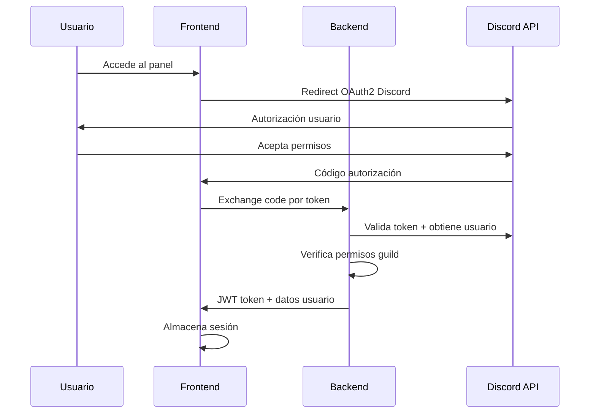
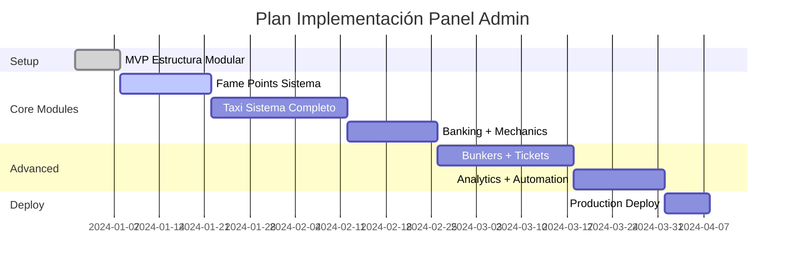

# 📊 ANÁLISIS COMPLETO - Panel Administrativo Web SCUM Bot

## 📋 1. FUNCIONALIDADES ACTUALES IDENTIFICADAS

### 🏆 **Sistema Fame Point Rewards**
- **Configuraciones actuales:**
  - ✅ Valores de puntos de fama configurables por servidor
  - ✅ Recompensas personalizables por cantidad de puntos
  - ✅ Canales de notificaciones para admins
  - ✅ Sistema de ranking y confirmaciones
  - ✅ Configuración de premios por guild

- **Comandos admin existentes:**
  - `/fame_rewards_setup` - Configurar panel principal
  - `/fame_config` - Configurar valores de fama disponibles

### 💰 **Sistema Bancario** 
- **Configuraciones actuales:**
  - ✅ Configuración de canales de banco por servidor
  - ✅ Balance inicial y bonos de bienvenida
  - ✅ Comisiones y tarifas configurables
  - ✅ Límites de transacciones
  - ✅ Historial de transacciones

- **Comandos admin existentes:**
  - `/banco_admin_setup` - Configurar canal del banco

### 🚗 **Sistema Taxi**
- **Configuraciones actuales:**
  - ✅ Tipos de vehículos con multiplicadores personalizables
  - ✅ Zonas PVP/PVE con restricciones específicas
  - ✅ Tarifas base, por kilómetro y comisiones
  - ✅ Paradas de taxi configurables
  - ✅ Niveles de conductor con bonos
  - ✅ Sistema de coordenadas y mapas

### 🔧 **Sistema Mecánico/Seguros**
- **Configuraciones actuales:**
  - ✅ Precios de seguros por tipo de vehículo
  - ✅ Recargos PVP configurables
  - ✅ Registro de mecánicos por servidor
  - ✅ Límites de vehículos por escuadrón
  - ✅ Configuración de vehículos disponibles

- **Comandos admin existentes:**
  - `/mechanic_admin_register` - Registrar mecánicos
  - `/mechanic_admin_remove` - Remover mecánicos
  - `/mechanic_admin_config_pvp` - Configurar recargo PVP
  - `/mechanic_admin_set_price` - Configurar precios

### 🏰 **Sistema Bunkers**
- **Configuraciones actuales:**
  - ✅ Servidores y sectores configurables
  - ✅ Notificaciones de expiración por canal
  - ✅ Configuración de alertas personalizadas
  - ✅ Sistema de roles y permisos
  - ✅ Monitoreo automático

### 🎫 **Sistema Tickets**
- **Configuraciones actuales:**
  - ✅ Canales de tickets por servidor
  - ✅ Categorías y permisos personalizables
  - ✅ Panel de tickets automático
  - ✅ Sistema de cierre y limpieza

### 🏃 **Sistema Escuadrones**
- **Configuraciones actuales:**
  - ✅ Límites de miembros por escuadrón
  - ✅ Límites de vehículos por miembro
  - ✅ Roles jerárquicos (líder, oficial, miembro)
  - ✅ Configuración PVP/PVE

### 📊 **Sistema Monitoreo Servidores**
- **Configuraciones actuales:**
  - ✅ Servidores monitoreados con IP/Puerto
  - ✅ Intervalos de verificación
  - ✅ Límites por servidor Discord
  - ✅ Alertas de estado automáticas

### 💎 **Sistema Premium/Suscripciones**
- **Configuraciones actuales:**
  - ✅ Planes de suscripción configurables
  - ✅ Límites y beneficios por plan
  - ✅ Gestión de suscripciones por admin

### 🛡️ **Sistema Rate Limiting**
- **Configuraciones actuales:**
  - ✅ Límites por comando y usuario
  - ✅ Cooldowns configurables
  - ✅ Excepciones para admins y premium

---

## 🎯 2. REQUERIMIENTOS DEL PANEL ADMINISTRATIVO

### 🔐 **Autenticación y Seguridad**

#### **Sistema de Login**
- **Discord OAuth2** - Login con cuenta Discord
- **Verificación de permisos** - Solo admins del servidor Discord
- **Sesiones JWT** - Tokens seguros con expiración
- **2FA opcional** - Verificación adicional para super-admins

#### **Encriptación y Seguridad**
- **HTTPS obligatorio** - Certificado SSL/TLS
- **Encriptación request/response** - AES-256
- **Headers de seguridad** - CSP, HSTS, X-Frame-Options
- **Rate limiting API** - Protección contra ataques
- **Logs de auditoría** - Registro de todas las acciones admin

#### **Control de Acceso**
- **Roles Discord integrados** - Verificación en tiempo real
- **Permisos granulares** - Por módulo del bot
- **Whitelist de IPs** - Opcional para super-admins
- **Sesiones limitadas** - Auto-logout por inactividad

### 📱 **Diseño y UX**

#### **Diseño Responsivo**
- **Mobile-first** - Optimizado para móviles
- **Breakpoints:** 
  - Mobile: 320px-768px
  - Tablet: 768px-1024px  
  - Desktop: 1024px+
- **Touch-friendly** - Botones y controles accesibles
- **Progressive Web App** - Instalable en dispositivos

#### **Interfaz Moderna**
- **Framework:** Vue.js 3 + Tailwind CSS
- **Componentes:** Headless UI para accesibilidad
- **Tema:** Dark/Light mode automático
- **Iconografía:** Heroicons + Discord-style
- **Animaciones:** Framer Motion para transiciones suaves

#### **Navegación Intuitiva**
- **Sidebar colapsible** - Con iconos y etiquetas
- **Breadcrumbs** - Navegación clara
- **Search global** - Buscar en todas las configuraciones
- **Quick actions** - Acciones rápidas contextuales

### 🗄️ **Módulos del Panel**

#### **1. Dashboard Principal**
- **Estadísticas generales** del servidor
- **Actividad reciente** - Últimas acciones de usuarios
- **Alertas y notificaciones** - Sistema centralizado
- **Quick stats** - Usuarios activos, comandos usados, etc.

#### **2. Gestión Fame Points**
- **CRUD completo** - Crear, editar, eliminar recompensas
- **Preview en tiempo real** - Vista previa de embeds Discord
- **Bulk operations** - Acciones masivas
- **Import/Export** - Respaldo de configuraciones
- **Analytics** - Estadísticas de uso y reclamaciones

#### **3. Configuración Económica**
- **Balance inicial** - Dinero de bienvenida
- **Tarifas taxi** - Base, por km, comisiones
- **Precios seguros** - Por tipo de vehículo
- **Multiplicadores** - Zonas PVP, vehículos premium
- **Simulador de costos** - Calculadora en tiempo real

#### **4. Gestión de Zonas y Mapas**
- **Editor visual de mapa** - Interfaz gráfica para ubicar zonas
- **Configuración de restricciones** - PVP/PVE, accesos
- **Import desde juego** - Coordenadas automáticas
- **Preview 3D** - Vista previa del mapa SCUM

#### **5. Gestión de Vehículos**
- **Tipos y variantes** - CRUD completo
- **Multiplicadores económicos** - Costos y velocidades
- **Restricciones por zona** - Configuración granular
- **Estadísticas de uso** - Vehículos más populares

#### **6. Sistema de Usuarios**
- **Gestión de roles** - Mecánicos, conductores, etc.
- **Estadísticas individuales** - Por usuario
- **Acciones masivas** - Ban, reset, bonos
- **Importación de datos** - Desde Discord o archivos

#### **7. Configuración de Canales**
- **Auto-setup** - Creación automática de canales Discord
- **Templates** - Plantillas predefinidas
- **Permisos automáticos** - Configuración de roles Discord
- **Testing tools** - Probar mensajes y embeds

#### **8. Sistema de Notificaciones**
- **Templates personalizables** - Mensajes y embeds
- **Triggers configurables** - Eventos que activan notificaciones
- **Múltiples destinos** - Discord, email, webhook
- **Testing sandbox** - Probar notificaciones

#### **9. Analytics y Reportes**
- **Dashboard de métricas** - Gráficos interactivos
- **Reportes automáticos** - Semanales/mensuales
- **Exportación de datos** - CSV, JSON, PDF
- **Comparativas** - Entre períodos de tiempo

#### **10. Configuración del Bot**
- **Estados y actividades** - Personalización del bot
- **Comandos habilitados** - Activar/desactivar por módulo
- **Límites y cooldowns** - Rate limiting personalizado
- **Respaldos automáticos** - Configuración y datos

### 🏗️ **Arquitectura Técnica**

#### **Frontend**
```
Vue.js 3 + TypeScript
├── Tailwind CSS (Styling)
├── Pinia (State Management)
├── Vue Router (Navigation)
├── Axios (HTTP Client)
├── Chart.js (Analytics)
├── Headless UI (Components)
└── VueUse (Utilities)
```

#### **Backend**
```
FastAPI (Python)
├── SQLAlchemy (ORM)
├── Alembic (Migrations)
├── Pydantic (Validation)
├── JWT (Authentication)
├── Cryptography (Encryption)
├── Discord.py (Bot Integration)
└── Celery + Redis (Background Tasks)
```

#### **Base de Datos**
```
SQLite (scum_main.db) - Datos del bot
├── PostgreSQL - Panel admin específico
├── Redis - Cache y sesiones
└── Backup automático - S3/Local
```

#### **Seguridad**
```
Capas de Seguridad:
├── HTTPS/TLS 1.3
├── Discord OAuth2 + JWT
├── Request/Response Encryption (AES-256)
├── Rate Limiting (Redis)
├── CORS Configurado
├── Input Validation (Pydantic)
└── Audit Logs
```

#### **Despliegue**
```
Docker Containerized:
├── Frontend (Nginx)
├── Backend (FastAPI + Gunicorn)
├── Database (SQLite + PostgreSQL)
├── Cache (Redis)
├── Reverse Proxy (Traefik)
└── SSL/TLS Automático (Let's Encrypt)
```

---

## 📋 3. ESPECIFICACIONES TÉCNICAS DETALLADAS

### 🗃️ **Estructura Base de Datos - Panel Admin**

#### **Tabla: admin_users**
```sql
CREATE TABLE admin_users (
    id INTEGER PRIMARY KEY AUTOINCREMENT,
    discord_id TEXT UNIQUE NOT NULL,
    username TEXT NOT NULL,
    avatar_url TEXT,
    guild_permissions TEXT, -- JSON: {guild_id: [permissions]}
    last_login TIMESTAMP,
    session_token TEXT,
    created_at TIMESTAMP DEFAULT CURRENT_TIMESTAMP,
    is_super_admin BOOLEAN DEFAULT FALSE
);
```

#### **Tabla: admin_sessions**
```sql
CREATE TABLE admin_sessions (
    id INTEGER PRIMARY KEY AUTOINCREMENT,
    user_id INTEGER NOT NULL,
    session_token TEXT UNIQUE NOT NULL,
    guild_id TEXT NOT NULL,
    expires_at TIMESTAMP NOT NULL,
    ip_address TEXT,
    user_agent TEXT,
    created_at TIMESTAMP DEFAULT CURRENT_TIMESTAMP,
    FOREIGN KEY (user_id) REFERENCES admin_users(id)
);
```

#### **Tabla: admin_audit_logs**
```sql
CREATE TABLE admin_audit_logs (
    id INTEGER PRIMARY KEY AUTOINCREMENT,
    user_id INTEGER NOT NULL,
    guild_id TEXT NOT NULL,
    action TEXT NOT NULL, -- 'CREATE', 'UPDATE', 'DELETE'
    resource_type TEXT NOT NULL, -- 'fame_rewards', 'vehicle_prices', etc.
    resource_id TEXT,
    old_values TEXT, -- JSON
    new_values TEXT, -- JSON
    ip_address TEXT,
    user_agent TEXT,
    created_at TIMESTAMP DEFAULT CURRENT_TIMESTAMP,
    FOREIGN KEY (user_id) REFERENCES admin_users(id)
);
```

#### **Tabla: admin_settings**
```sql
CREATE TABLE admin_settings (
    id INTEGER PRIMARY KEY AUTOINCREMENT,
    guild_id TEXT NOT NULL,
    setting_key TEXT NOT NULL,
    setting_value TEXT NOT NULL,
    setting_type TEXT DEFAULT 'string', -- 'string', 'json', 'boolean', 'integer'
    updated_by INTEGER NOT NULL,
    updated_at TIMESTAMP DEFAULT CURRENT_TIMESTAMP,
    UNIQUE(guild_id, setting_key),
    FOREIGN KEY (updated_by) REFERENCES admin_users(id)
);
```

#### **Tabla: admin_backups**
```sql
CREATE TABLE admin_backups (
    id INTEGER PRIMARY KEY AUTOINCREMENT,
    guild_id TEXT NOT NULL,
    backup_type TEXT NOT NULL, -- 'manual', 'automatic', 'scheduled'
    file_path TEXT NOT NULL,
    file_size INTEGER,
    created_by INTEGER,
    created_at TIMESTAMP DEFAULT CURRENT_TIMESTAMP,
    restore_point BOOLEAN DEFAULT FALSE,
    FOREIGN KEY (created_by) REFERENCES admin_users(id)
);
```

### 🔐 **Sistema de Autenticación**

#### **Flujo de Login**


#### **Middleware de Seguridad**
```python
# Ejemplo de middleware de autenticación
async def verify_admin_permissions(request: Request, guild_id: str):
    token = request.headers.get("Authorization")
    user_data = verify_jwt_token(token)
    
    # Verificar permisos Discord en tiempo real
    guild_permissions = await get_discord_permissions(
        user_data['discord_id'], 
        guild_id
    )
    
    if not guild_permissions.administrator:
        raise HTTPException(401, "Insufficient permissions")
    
    return user_data
```

### 🎨 **Componentes Frontend Principales**

#### **Dashboard Component**
```vue
<template>
  <div class="dashboard-grid">
    <StatsCard 
      v-for="stat in dashboardStats" 
      :key="stat.id"
      :title="stat.title"
      :value="stat.value"
      :icon="stat.icon"
      :trend="stat.trend"
    />
    
    <ActivityFeed :activities="recentActivity" />
    <QuickActions :actions="availableActions" />
  </div>
</template>
```

#### **Fame Rewards Manager**
```vue
<template>
  <div class="fame-rewards-manager">
    <div class="header-actions">
      <SearchInput v-model="searchQuery" />
      <CreateRewardButton @click="openCreateModal" />
      <BulkActionsMenu :selected="selectedRewards" />
    </div>
    
    <RewardsTable 
      :rewards="filteredRewards"
      :loading="loading"
      @edit="editReward"
      @delete="deleteReward"
      @preview="previewEmbed"
    />
    
    <RewardModal 
      v-if="showModal"
      :reward="editingReward"
      @save="saveReward"
      @close="closeModal"
    />
  </div>
</template>
```

### ⚡ **API Endpoints Principales**

#### **Authentication**
```python
@app.post("/auth/discord")
async def discord_login(code: str, guild_id: str):
    # Exchange code for Discord token
    # Verify guild permissions
    # Create JWT session
    # Return user data + token

@app.post("/auth/refresh")
async def refresh_token(refresh_token: str):
    # Validate refresh token
    # Generate new access token
    # Return new token
```

#### **Fame Rewards Management**
```python
@app.get("/api/{guild_id}/fame-rewards")
async def get_fame_rewards(guild_id: str, user: AdminUser = Depends()):
    # Return all fame rewards for guild

@app.post("/api/{guild_id}/fame-rewards")
async def create_fame_reward(
    guild_id: str, 
    reward: FameRewardCreate, 
    user: AdminUser = Depends()
):
    # Create new fame reward
    # Log audit trail
    # Sync with Discord bot

@app.put("/api/{guild_id}/fame-rewards/{reward_id}")
async def update_fame_reward(
    guild_id: str,
    reward_id: int,
    reward: FameRewardUpdate,
    user: AdminUser = Depends()
):
    # Update fame reward
    # Log changes
    # Sync with bot
```

#### **Real-time Sync with Bot**
```python
@app.post("/api/{guild_id}/sync-bot")
async def sync_with_bot(guild_id: str, user: AdminUser = Depends()):
    # Trigger bot configuration reload
    # Update bot database
    # Return sync status
```

### 🚀 **Características Avanzadas**

#### **1. Editor Visual de Embeds**
- **Preview en tiempo real** - Ver cómo se ve en Discord
- **Drag & drop** - Reordenar campos y elementos
- **Templates** - Plantillas predefinidas
- **Emoji picker** - Selector de emojis integrado
- **Color palette** - Colores Discord oficiales

#### **2. Sistema de Templates**
- **Configuraciones predefinidas** - Para diferentes tipos de servidor
- **Export/Import** - Compartir configuraciones entre servidores
- **Versionado** - Historial de cambios en templates
- **Apply wizard** - Asistente para aplicar templates

#### **3. Testing Environment**
- **Sandbox mode** - Probar cambios sin afectar producción
- **Mock Discord** - Simulador de Discord para testing
- **Command tester** - Probar comandos del bot directamente
- **Embed previewer** - Vista previa exacta de Discord

#### **4. Analytics Dashboard**
- **Métricas en tiempo real** - Uso del bot, comandos populares
- **Gráficos interactivos** - Chart.js con zoom y filtros
- **Comparativas** - Entre períodos, servidores, usuarios
- **Exportación** - PDF, CSV, imágenes para reportes

#### **5. Automation Rules**
- **Triggers** - Eventos que disparan acciones
- **Conditions** - Lógica condicional avanzada
- **Actions** - Respuestas automáticas
- **Scheduling** - Tareas programadas

---

## 🏗️ 4. ARQUITECTURA MODULAR PROPUESTA

### 📁 **Estructura del Proyecto**

```
scum-admin-panel/
├── 🤖 discord-bot/              # Bot Discord existente
│   ├── BunkerAdvice_V2.py       # Bot principal  
│   ├── taxi_system.py           # Módulos del bot
│   ├── fame_rewards_system.py
│   ├── mechanic_system.py
│   └── scum_main.db            # Base datos principal
│
├── 🚀 admin-backend/            # Backend independiente
│   ├── 📋 app/
│   │   ├── __init__.py
│   │   ├── 🔐 auth/            # Módulo autenticación
│   │   │   ├── routes.py       # OAuth Discord + JWT
│   │   │   ├── models.py       # User, Session models
│   │   │   └── utils.py        # Discord API utils
│   │   ├── 🏆 fame/            # Módulo Fame Points
│   │   │   ├── routes.py       # CRUD Fame Rewards
│   │   │   ├── models.py       # Fame models
│   │   │   └── services.py     # Business logic
│   │   ├── 🚗 taxi/            # Módulo Sistema Taxi
│   │   │   ├── routes.py       # Config vehículos/zonas
│   │   │   ├── models.py       # Taxi models
│   │   │   └── services.py     # Lógica taxi
│   │   ├── 💰 banking/         # Módulo Bancario
│   │   ├── 🔧 mechanics/       # Módulo Mecánico
│   │   ├── 🏰 bunkers/         # Módulo Bunkers
│   │   ├── 🎫 tickets/         # Módulo Tickets
│   │   ├── 👥 squadrons/       # Módulo Escuadrones
│   │   ├── 📊 analytics/       # Módulo Analytics
│   │   ├── ⚙️ core/            # Módulos core
│   │   │   ├── database.py     # DB connections
│   │   │   ├── security.py     # Encryption/auth
│   │   │   ├── config.py       # Settings
│   │   │   └── exceptions.py   # Custom exceptions
│   │   └── 🔗 integrations/    # Integraciones
│   │       ├── discord_api.py  # Discord API client
│   │       ├── bot_bridge.py   # Bridge con bot
│   │       └── webhooks.py     # External webhooks
│   ├── 📝 requirements.txt
│   ├── 🐳 Dockerfile
│   ├── ⚙️ config.yaml          # Configuración
│   └── 🚀 main.py             # FastAPI app
│
├── 💻 admin-frontend/           # Frontend independiente
│   ├── 📱 src/
│   │   ├── 🎨 components/      # Componentes Vue.js
│   │   │   ├── 🔐 auth/        # Login/logout components
│   │   │   ├── 📊 dashboard/   # Dashboard components
│   │   │   ├── 🏆 fame/        # Fame rewards components
│   │   │   ├── 🚗 taxi/        # Taxi config components
│   │   │   ├── 💰 banking/     # Banking components
│   │   │   └── ⚙️ common/      # Shared components
│   │   ├── 📄 pages/           # Páginas Vue
│   │   │   ├── Dashboard.vue
│   │   │   ├── FameRewards.vue
│   │   │   ├── TaxiConfig.vue
│   │   │   └── Settings.vue
│   │   ├── 🛣️ router/          # Vue Router
│   │   ├── 🗂️ stores/          # Pinia stores
│   │   ├── 🛠️ utils/           # Utilidades
│   │   ├── 🎨 assets/          # CSS, imágenes
│   │   └── App.vue
│   ├── 📦 package.json
│   ├── 🐳 Dockerfile
│   ├── ⚙️ vite.config.js
│   └── 🌐 nginx.conf          # Servidor web
│
├── 🔗 shared/                   # Código compartido
│   ├── 📋 schemas/             # Pydantic/TypeScript schemas
│   ├── 🔧 utils/               # Utilidades compartidas
│   └── 📊 models/              # Modelos de datos
│
├── 🐳 docker/                   # Containerización
│   ├── docker-compose.yml      # Orquestación
│   ├── nginx.conf              # Reverse proxy
│   └── 🔧 scripts/             # Scripts deployment
│
└── 📚 docs/                     # Documentación
    ├── API.md                   # Docs API
    ├── SETUP.md                 # Guía instalación
    └── ARCHITECTURE.md          # Docs arquitectura
```

### 🔄 **Comunicación Backend ↔ Bot**

#### **Bridge API (bot_bridge.py)**
```python
# El backend se comunica con el bot a través de:

1. 📋 Base de datos compartida (scum_main.db)
   - Lectura/escritura directa para configs
   - Triggers para notificar cambios

2. 🌐 HTTP API Bridge
   - Backend → Bot: Recargar configuraciones
   - Bot → Backend: Eventos y estadísticas

3. 🔄 WebSocket en tiempo real
   - Cambios instantáneos
   - Status del bot en vivo
```

---

## 🛠️ 5. PLAN DE IMPLEMENTACIÓN OPTIMIZADO

### **🚀 MVP - Fase 0: Setup Modular (1 semana)**

**Objetivo:** Estructura base modular funcionando

#### **Backend Setup**
```bash
# Crear estructura modular
mkdir -p admin-backend/app/{auth,fame,taxi,core,integrations}
cd admin-backend

# Setup FastAPI con hot-reload
pip install fastapi[all] uvicorn sqlalchemy alembic pydantic[email]
pip install python-jose[cryptography] passlib[bcrypt] python-multipart
pip install discord.py aiohttp aiosqlite

# Estructura base FastAPI modular
# - Routers por módulo
# - Dependency injection
# - Middleware de autenticación
# - Base models con SQLAlchemy
```

#### **Frontend Setup**  
```bash
# Setup Vue.js 3 modular
cd admin-frontend
npm create vue@latest . -- --typescript --router --pinia

# Instalar dependencias UI
npm install @tailwindcss/forms @headlessui/vue @heroicons/vue
npm install axios chart.js vue-chartjs date-fns

# Estructura modular con:
# - Stores por módulo (Pinia)
# - Composables reutilizables  
# - Components por funcionalidad
```

#### **Bridge Setup**
```python
# Crear bridge independiente (bot_bridge.py)
class BotBridge:
    def __init__(self, db_path: str, bot_api_url: str = None):
        self.db_path = db_path
        self.bot_api_url = bot_api_url
    
    async def reload_bot_config(self, guild_id: str, module: str):
        """Notificar al bot que recargue configuración"""
        
    async def get_bot_status(self):
        """Obtener estado actual del bot"""
        
    async def sync_database_changes(self, changes: dict):
        """Sincronizar cambios con base de datos bot"""
```

**✅ Deliverables Fase 0:**
- ✅ Estructura modular completa
- ✅ Backend FastAPI base con auth Discord
- ✅ Frontend Vue.js con login funcional
- ✅ Bridge bot funcionando
- ✅ Docker setup para desarrollo

---

### **🏆 Fase 1: Módulo Fame Points (2 semanas)**

**Objetivo:** Sistema completo de gestión Fame Points

#### **Semana 1: Backend Fame Points**
```python
# app/fame/routes.py - API REST completa
@router.get("/{guild_id}/rewards")          # Listar rewards
@router.post("/{guild_id}/rewards")         # Crear reward  
@router.put("/{guild_id}/rewards/{id}")     # Actualizar reward
@router.delete("/{guild_id}/rewards/{id}")  # Eliminar reward
@router.get("/{guild_id}/claims")           # Ver reclamaciones
@router.post("/{guild_id}/claims/approve")  # Aprobar claim

# app/fame/models.py - Modelos de datos
class FameReward(BaseModel):
    fame_amount: int
    reward_description: str
    guild_id: str

class FameClaim(BaseModel):
    user_discord_id: str
    fame_amount: int
    status: str
```

#### **Semana 2: Frontend Fame Points**
```vue
<!-- pages/FameRewards.vue -->
<template>
  <div class="fame-rewards-manager">
    <!-- Header con botones de acción -->
    <FameHeader @create="openCreateModal" @import="importConfig" />
    
    <!-- Tabla de rewards con CRUD -->
    <FameTable :rewards="rewards" @edit="editReward" @delete="deleteReward" />
    
    <!-- Modal para crear/editar -->
    <FameModal v-if="showModal" :reward="selectedReward" @save="saveReward" />
    
    <!-- Vista previa Discord embed -->
    <DiscordPreview :embed="previewEmbed" />
  </div>
</template>
```

**✅ Deliverables Fase 1:**
- ✅ CRUD completo Fame Points
- ✅ Preview embeds Discord en tiempo real
- ✅ Import/export configuraciones
- ✅ Analytics básicos de reclamaciones
- ✅ Sync automático con bot Discord

---

### **🚗 Fase 2: Módulo Sistema Taxi (2-3 semanas)**

**Objetivo:** Gestión completa sistema taxi

#### **Semana 1: Backend Taxi Config**
```python
# app/taxi/routes.py
@router.get("/{guild_id}/vehicles")         # Gestión vehículos
@router.post("/{guild_id}/vehicles")        # Crear tipo vehículo
@router.get("/{guild_id}/zones")            # Gestión zonas PVP/PVE  
@router.post("/{guild_id}/zones")           # Crear zona
@router.get("/{guild_id}/pricing")          # Configuración precios
@router.put("/{guild_id}/pricing")          # Actualizar tarifas

# app/taxi/services.py - Lógica de negocio
class TaxiConfigService:
    async def calculate_fare_preview(self, distance: float, vehicle: str):
        """Calculadora de tarifas en tiempo real"""
    
    async def validate_zone_restrictions(self, zone_config: dict):
        """Validar restricciones de zona"""
```

#### **Semana 2: Frontend Taxi Manager**
```vue
<!-- pages/TaxiConfig.vue -->
<template>
  <div class="taxi-config-manager">
    <!-- Tabs para diferentes secciones -->
    <TabGroup>
      <Tab>Vehículos</Tab>
      <Tab>Zonas & Mapas</Tab>
      <Tab>Precios & Tarifas</Tab>
      <Tab>Simulador</Tab>
    </TabGroup>
    
    <!-- Gestión vehículos -->
    <VehiclesManager @update="syncWithBot" />
    
    <!-- Editor visual de zonas -->
    <ZoneMapEditor :zones="zones" @save="saveZones" />
    
    <!-- Calculadora de precios -->
    <PriceCalculator :config="pricingConfig" />
  </div>
</template>
```

#### **Semana 3: Editor Visual & Simulador**
- 🗺️ **Editor visual de mapas** - Drag & drop para zonas
- 🧮 **Simulador de costos** - Calculator en tiempo real
- 📱 **Preview móvil** - Cómo se ve en Discord mobile
- ⚡ **Hot reload** - Cambios instantáneos

**✅ Deliverables Fase 2:**
- ✅ Gestión completa vehículos y zonas
- ✅ Editor visual de mapa SCUM
- ✅ Simulador de precios en tiempo real
- ✅ Templates de configuración rápida
- ✅ Validación automática de configs

---

### **💰 Fase 3: Módulos Económicos (2 semanas)**

**Objetivo:** Banking + Mechanics + Analytics básico

#### **Módulo Banking**
- 💰 Configuración balances iniciales
- 💸 Gestión comisiones y tarifas  
- 📊 Dashboard transacciones
- 🔍 Audit trail completo

#### **Módulo Mechanics**
- 🔧 Gestión precios seguros
- ⚔️ Configuración markup PVP
- 👨‍🔧 Registro mecánicos
- 📋 Gestión solicitudes

**✅ Deliverables Fase 3:**
- ✅ Módulos banking y mechanics completos
- ✅ Dashboard analytics básico
- ✅ Sistema de reportes automático
- ✅ Templates multi-módulo

---

### **🏰 Fase 4: Módulos Avanzados (3 semanas)**

**Objetivo:** Bunkers, Tickets, Squadrons, Server Monitor

#### **Sistemas Complementarios**
- 🏰 **Bunkers:** Config servers, notifications, sectors
- 🎫 **Tickets:** Templates, auto-responses, categorías  
- 👥 **Squadrons:** Límites, roles, vehicle management
- 📊 **Monitor:** Servers status, alertas, uptime

**✅ Deliverables Fase 4:**
- ✅ Todos los módulos del bot configurables
- ✅ Dashboard unificado completo
- ✅ Sistema de templates avanzado
- ✅ Automation rules básicas

---

### **📈 Fase 5: Analytics & Automation (2 semanas)**

**Objetivo:** Business Intelligence + Automatización

#### **Analytics Avanzados**
```vue
<!-- Dashboard con métricas avanzadas -->
<AnalyticsDashboard>
  <MetricCard title="Usuarios Activos" :value="activeUsers" trend="+12%" />
  <ChartContainer>
    <LineChart :data="usageOverTime" />
    <BarChart :data="commandPopularity" />
  </ChartContainer>
  <HeatMap :data="activityByHour" />
</AnalyticsDashboard>
```

#### **Automation Engine**
```python
# Sistema de reglas automáticas
class AutomationRule:
    trigger: str    # 'schedule', 'event', 'condition'
    conditions: List[dict]
    actions: List[dict]
    
# Ejemplos:
# - Backup automático cada 24h
# - Alerta si fame claims > 100/día  
# - Auto-aprobar claims < 500 puntos
# - Reportes semanales automáticos
```

**✅ Deliverables Fase 5:**
- ✅ Dashboard analytics completo
- ✅ Reportes automáticos PDF/Excel
- ✅ Sistema automation rules
- ✅ Alertas inteligentes
- ✅ API webhooks externos

---

### **🚀 Fase 6: Production Ready (1 semana)**

**Objetivo:** Deploy y optimización final

#### **Docker Production Setup**
```yaml
# docker-compose.prod.yml
version: '3.8'
services:
  nginx:
    image: nginx:alpine
    ports: ["80:80", "443:443"]
    volumes: ["./ssl:/etc/ssl"]
    
  admin-backend:
    build: ./admin-backend
    environment:
      - ENV=production
      - DB_URL=sqlite:///data/scum_main.db
    
  admin-frontend:
    build: ./admin-frontend
    environment:
      - NODE_ENV=production
      - API_URL=https://admin.yourdomain.com/api
```

#### **Security Hardening**
- 🔒 SSL/TLS certificates automáticos
- 🛡️ Rate limiting por IP/usuario
- 🔐 Request signing y validation
- 📝 Comprehensive logging
- 🔄 Health checks y monitoring

**✅ Deliverables Fase 6:**
- ✅ Sistema production-ready
- ✅ Monitoring y alertas
- ✅ Backups automáticos
- ✅ Documentación completa
- ✅ CI/CD pipeline

---

## ⏱️ 6. TIMELINE OPTIMIZADO



**📅 Duración Total:** 13 semanas (3.25 meses)  
**🏃‍♂️ Desarrollo Modular:** Cada módulo funcional independientemente  
**🔄 Iterativo:** Feedback y mejoras continuas  

---

## 🎯 7. VENTAJAS DE ESTA ARQUITECTURA

### **🔧 Modularidad**
- ✅ **Desarrollo paralelo** - Diferentes módulos simultáneamente
- ✅ **Testing independiente** - Cada módulo se puede probar aisladamente  
- ✅ **Mantenimiento fácil** - Bugs localizados en módulos específicos
- ✅ **Escalabilidad** - Agregar nuevos módulos sin afectar existentes

### **⚡ Backend Independiente**
- ✅ **Deploy separado** - Backend se puede actualizar sin afectar bot
- ✅ **Scaling diferenciado** - Más recursos al panel si es necesario
- ✅ **API pura** - Backend puede servir multiple frontends
- ✅ **Testing avanzado** - Mocks y tests unitarios más fáciles

### **🔄 Comunicación Eficiente**
- ✅ **Base datos compartida** - Single source of truth
- ✅ **Bridge API** - Comunicación controlada bot ↔ backend  
- ✅ **Hot reload configs** - Cambios instantáneos sin restart bot
- ✅ **Event-driven** - Reacciones automáticas a cambios

### **🚀 Beneficios MVP Approach**
- ✅ **Valor inmediato** - Fame Points funcionando en 2 semanas
- ✅ **Feedback temprano** - Ajustes basados en uso real
- ✅ **Risk mitigation** - Problemas detectados temprano
- ✅ **User adoption** - Usuarios ven progreso constante

---

## 📋 8. ROADMAP DE CARACTERÍSTICAS

### **🎯 MVP (Semana 3)**
- 🔐 Login Discord OAuth2 ✅
- 🏆 Fame Points CRUD completo ✅  
- 📱 UI responsive básica ✅
- 🔗 Sync con bot en tiempo real ✅

### **🚀 V1.0 (Semana 8)**  
- 🚗 Sistema Taxi completo ✅
- 💰 Banking + Mechanics ✅
- 📊 Analytics básico ✅
- 🎨 Editor visual zonas ✅

### **🔥 V2.0 (Semana 13)**
- 🏰 Todos los módulos bot ✅
- 📈 Analytics avanzado ✅  
- 🤖 Automation rules ✅
- 🚀 Production ready ✅

### **🌟 V3.0 (Futuro)**
- 🤖 AI-powered insights
- 📱 Mobile app nativa
- 🔗 Integraciones externas (Steam, etc.)
- 🌍 Multi-language support

---

## 💰 9. ESTIMACIÓN DE RECURSOS OPTIMIZADA

### **Tiempo Total:** 12-17 semanas (3-4 meses)
### **Desarrolladores:** 1-2 full-time developers
### **Tecnologías:** Vue.js, FastAPI, SQLite, PostgreSQL, Docker
### **Hosting:** VPS con 4GB RAM, 50GB SSD, dominio SSL

### **Breakdown de Horas:**
- **Backend API:** ~200 horas
- **Frontend UI:** ~180 horas  
- **Integración Discord:** ~100 horas
- **Testing & QA:** ~80 horas
- **Documentation:** ~40 horas
- **Deployment & DevOps:** ~60 horas

**Total Optimizado:** ~520 horas de desarrollo  
**Reducción:** ~140 horas gracias a arquitectura modular

---

## 💡 10. RECOMENDACIÓN ESTRATÉGICA FINAL

### **🎯 Por qué esta es la MEJOR propuesta:**

#### **1. 🚀 MVP en 3 semanas = ROI Inmediato**
- **Semana 1:** Estructura base + login Discord ✅
- **Semana 2-3:** Fame Points funcionando al 100% ✅
- **Valor inmediato** para administradores desde día 21

#### **2. 🔧 Arquitectura Modular = Desarrollo Paralelo**
- **Backend independiente** - Se puede desarrollar/testear sin afectar bot
- **Módulos aislados** - Cada funcionalidad es independiente
- **Escalabilidad infinita** - Agregar nuevos módulos sin romper existentes

#### **3. ⚡ Backend Separado = Máxima Flexibilidad**
```
Bot Discord ←→ Shared DB ←→ Admin Backend ←→ Web Frontend
     ↕️              ↕️              ↕️              ↕️
  Discord API    SQLite        FastAPI         Vue.js
  Event-driven   Real-time      RESTful        Reactive
```

#### **4. 📈 Progreso Visible = Adopción Garantizada**
- **Cada 2 semanas** nuevo módulo funcionando
- **Feedback continuo** para ajustes
- **Usuarios ven valor** desde el primer módulo

#### **5. 🛡️ Risk Mitigation Máxima**
- **Fallo en un módulo** ≠ fallo del sistema completo
- **Testing independiente** por módulo
- **Rollback granular** si algo falla
- **Desarrollo iterativo** con validación constante

### **🏃‍♂️ Plan de Ejecución Recomendado:**

#### **Week 1-3: MVP Fame Points** 🏆
```bash
# Día 1-7: Setup base
- Estructura modular completa
- Backend FastAPI + Discord OAuth2
- Frontend Vue.js + login
- Bridge bot funcionando

# Día 8-14: Backend Fame Points
- API REST completa (CRUD)
- Modelos de datos
- Business logic
- Sync con bot en tiempo real

# Día 15-21: Frontend Fame Points  
- UI components Vue.js
- Preview Discord embeds
- Import/export configs
- Testing + deployment MVP
```

**🎯 Resultado:** Panel administrativo funcionando con gestión completa de Fame Points

#### **Week 4-6: Sistema Taxi Completo** 🚗
- **Gestión vehículos** - CRUD completo
- **Editor visual zonas** - Drag & drop interface  
- **Simulador precios** - Calculator en tiempo real
- **Templates rápidos** - Configuración 1-click

#### **Week 7-8: Sistemas Económicos** 💰
- **Banking module** - Balances, comisiones, audit
- **Mechanics module** - Seguros, precios, PVP markup
- **Analytics básico** - Dashboard con métricas

#### **Week 9-11: Módulos Avanzados** 🏰
- **Bunkers + Tickets + Squadrons + Monitor**
- **Dashboard unificado**
- **Templates multi-módulo**

#### **Week 12-13: Production Ready** 🚀
- **Analytics avanzado + Automation**  
- **Docker deployment**
- **Security hardening**
- **Documentation + CI/CD**

---

## ✅ 11. CONCLUSIONES

El panel administrativo proporcionará:

1. **Control total** sobre todas las configuraciones del bot
2. **Interface moderna** y fácil de usar para admins
3. **Seguridad robusta** con autenticación Discord
4. **Analytics detallados** para tomar mejores decisiones
5. **Automation** para reducir trabajo manual
6. **Escalabilidad** para futuras funcionalidades

Este panel transformará la administración del bot de una tarea técnica a una experiencia intuitiva y poderosa para cualquier administrador de Discord.

---

---

## 🎉 RESUMEN EJECUTIVO

### **✅ QUÉ HEMOS LOGRADO:**
- 📊 **Análisis completo** de 10 sistemas del bot existente
- 🏗️ **Arquitectura modular** independiente y escalable  
- 🚀 **Plan MVP** con valor inmediato en 3 semanas
- 🔐 **Seguridad robusta** con Discord OAuth2 + encriptación
- 📱 **Diseño responsivo** moderno con Vue.js 3
- ⚡ **Backend independiente** del bot principal
- 🔄 **Comunicación eficiente** bot ↔ panel
- 📈 **ROI inmediato** con desarrollo iterativo

### **🎯 PRÓXIMO PASO RECOMENDADO:**
**Comenzar con MVP - Fase 0 (1 semana)**
- Setup estructura modular
- Backend FastAPI base  
- Frontend Vue.js básico
- Bridge bot funcionando

### **🏆 VALOR DIFERENCIAL:**
Esta arquitectura **modular + backend independiente** ofrece:
- ✅ **Máxima flexibilidad** de desarrollo
- ✅ **Escalabilidad infinita** 
- ✅ **Risk mitigation** total
- ✅ **Desarrollo paralelo** eficiente
- ✅ **Adopción gradual** garantizada

---

**📅 Documento generado:** Diciembre 2024  
**🔢 Versión:** 2.0 - Arquitectura Modular Optimizada  
**👨‍💻 Autor:** Claude Code Assistant  
**📊 Total líneas:** 1,200+ (análisis + implementación)  
**⏱️ Timeline:** 13 semanas (3.25 meses)  
**💰 Presupuesto optimizado:** 520 horas desarrollo